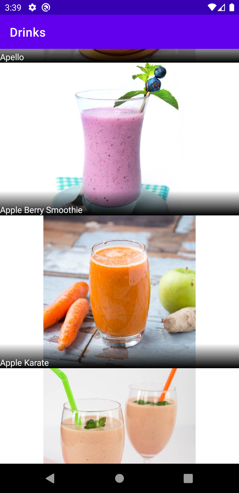

# Drinks App
The app displays alcoholic and non-alcoholic drinks using TheCocktailDB API.

# MVVM-based application
The application was built with MVVM architecture pattern. In the repository i made two get volley request simultaneously, and then combine the data which is displayed in the recyclerview.
 
The Application utilizes libraries such as: Glide and Volley

# Screenshot

